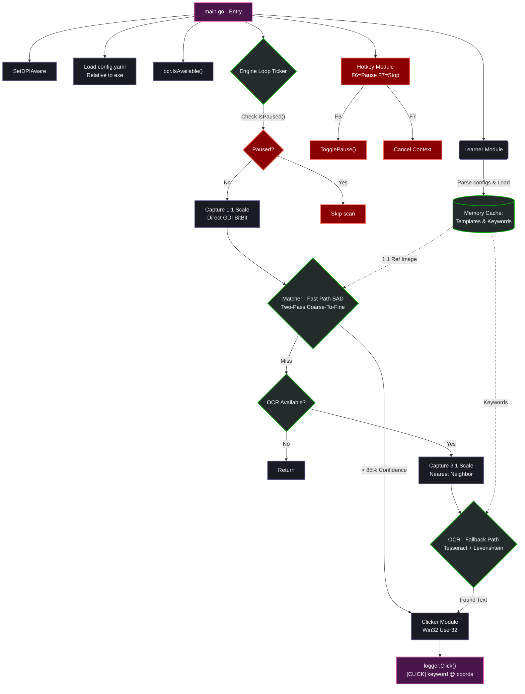

# System Architecture — AutoClickAccepted v3.2.0 Hybrid

## Tổng Quan

AutoClickAccepted là bot tự động click nút trên màn hình Windows, sử dụng kiến trúc **Hybrid** kết hợp:
1. **Template Matching** (Fast Path) — So khớp pixel 1:1, multi-threaded SAD
2. **OCR Fallback** (Slow Path) — Tesseract text recognition, fuzzy matching

Viết hoàn toàn bằng **Pure Go** — không CGO, chỉ dùng `golang.org/x/sys/windows` syscalls.

---

## Workflow Tổng Thể

```
┌─────────────┐
│  Khởi động  │
└──────┬──────┘
       ▼
┌──────────────────────────────────────────────────────────────┐
│ 1. SetDPIAware()     — Đảm bảo tọa độ chính xác trên HiDPI │
│ 2. Load config.yaml  — Resolve relative to exe location      │
│ 3. Init Logger       — File + Console dual output            │
│ 4. ocr.IsAvailable() — Check Tesseract 1 lần (optional)     │
│ 5. Learner scan img/ — Load templates + OCR extract keywords │
│ 6. Region Selection  — Interactive hoặc config scan_region   │
│ 7. Register Hotkeys  — F6 (Pause/Resume) + F7 (Stop)        │
└──────────────────────────────────┬───────────────────────────┘
                                   ▼
                          ┌────────────────┐
                          │  Engine Loop   │◄── Ticker (1500ms)
                          └───────┬────────┘
                                  │
                          ┌───────▼────────┐
                          │  IsPaused()?   │── Yes → skip
                          └───────┬────────┘
                                  │ No
                          ┌───────▼────────┐
                          │ Capture 1:1    │ GDI BitBlt
                          └───────┬────────┘
                                  │
                   ┌──────────────▼──────────────┐
                   │   Template Match (SAD)       │
                   │   Multi-threaded 4 workers   │
                   │   85% threshold              │
                   └──────┬─────────────┬─────────┘
                          │             │
                     Match found    No match
                          │             │
                          │    ┌────────▼─────────┐
                          │    │ OCR Available?    │── No → return
                          │    └────────┬─────────┘
                          │             │ Yes
                          │    ┌────────▼─────────┐
                          │    │ Capture 3x scale  │
                          │    │ Tesseract --psm 11│
                          │    │ Fuzzy keyword match│
                          │    └────────┬─────────┘
                          │             │
                          ▼             ▼
                   ┌─────────────────────────┐
                   │       Clicker           │
                   │ Background (PostMessage)│
                   │ or Physical (SendInput) │
                   └────────────┬────────────┘
                                │
                   ┌────────────▼────────────┐
                   │  logger.Click()         │
                   │  "ACCEPTED" @ (450,320) │
                   │  Stats.ClicksByLabel++  │
                   └─────────────────────────┘
```

---

## Mermaid Data Flow



---

## Module Breakdown

### Directory Structure

```text
AutoClickAccepted/
├── cmd/
│   └── main.go              # Entry point — wiring only, no business logic
├── internal/
│   ├── capture/capture.go   # Windows GDI screen capture (syscall)
│   ├── clicker/clicker.go   # Mouse click: PostMessage (BG) + SendInput (Physical)
│   ├── engine/engine.go     # Central scan loop, pause/resume, stats
│   ├── hotkey/hotkey.go     # Global F6/F7 hotkey via RegisterHotKey
│   ├── learner/learner.go   # Auto-learn keywords from img/ folder
│   ├── logger/logger.go     # Dual-output logger (file + console)
│   ├── matcher/matcher.go   # Pixel-level SAD template matching
│   ├── ocr/ocr.go           # Tesseract CLI wrapper + fuzzy text matching
│   └── selector/selector.go # Interactive screen region selector (PowerShell)
├── img/                     # Ảnh mẫu nút (cropped button screenshots)
├── config.yaml              # Runtime configuration
├── dependencies/            # Tesseract OCR installer (optional)
└── Makefile                 # Build targets
```

---

### `cmd/main.go` — Entry Point

| Chức năng | Mô tả |
|----------|-------|
| `ensureConsole()` | Allocate console nếu build `-H windowsgui` |
| `setDPIAware()` | Gọi `SetProcessDPIAware` để tọa độ chính xác |
| `getExeDir()` / `resolvePath()` | Resolve config/img relative to exe (portable) |
| `loadConfig()` | Đọc YAML, set defaults |
| `ocr.IsAvailable()` | Check Tesseract 1 lần, pass flag cho engine |
| `learner.LearnFromImages()` | Quét img/ → templates + keywords |
| `hotkey.Listen()` | Goroutine lắng nghe F6/F7 |
| Stats at shutdown | In per-keyword click breakdown |

---

### `internal/engine/` — The Brain

**State Management:**
```go
type Engine struct {
    region image.Rectangle
    config Config
    stats  Stats
    mu     sync.RWMutex  // guards paused state
    paused bool
}
```

**Pause/Resume Methods:**
- `Pause()` — Set paused = true, log `🔴 PAUSED`
- `Resume()` — Set paused = false, log `🟢 RESUMED`
- `TogglePause()` — Toggle, log trạng thái
- `IsPaused()` — Read-lock check

**Per-Keyword Stats:**
```go
type Stats struct {
    TotalScans    int
    TotalClicks   int
    TotalErrors   int
    ClicksByLabel map[string]int  // "ACCEPTED":12, "OK":3
}
```

**Scan Logic:**
1. Template Match (1:1 capture → SAD matching, 85% threshold)
2. OCR Fallback (3x capture → Tesseract, fuzzy keyword match)
3. Dedup: bán kính 300px tránh click trùng
4. Max 3 clicks per scan chống spam

---

### `internal/hotkey/` — Global Hotkey

Dùng Win32 API:
- `RegisterHotKey(0, id, 0, VK_F6/VK_F7)`
- `GetMessageW` message pump trong goroutine riêng
- Gửi `ActionTogglePause` / `ActionStop` qua channel
- `UnregisterHotKey` khi cleanup

**Hoạt động toàn hệ thống** — không cần focus console window.

---

### `internal/matcher/` — Template Matching Engine

Thuật toán **Sum of Absolute Differences (SAD)** — pure Go:

1. **Pre-compute:** Extract opaque pixels (alpha ≥ 128), cache RGB values
2. **Coarse Pass:** 200 uniformly sampled pixels → early reject >99% candidates
3. **Fine Pass:** Full pixel sweep (chỉ chạy nếu coarse pass pass)
4. **Multi-threaded:** 4 goroutines chia vùng Y
5. **Non-Maximum Suppression:** 150px radius → giữ 1 best match per button
6. **Early Exit:** Abort khi diff vượt threshold giữa chừng

**Performance:** ~10ms per template trên region 800x600.

---

### `internal/ocr/` — Tesseract OCR

| Function | Mô tả |
|---------|-------|
| `IsAvailable()` | Check Tesseract trên PATH + fallback location. Call 1 lần |
| `DetectText()` | Run `tesseract --psm 11 tsv`, parse bounding boxes |
| `FindKeywords()` | Exact match → Contains match → Levenshtein fuzzy |
| `FindMultiWordKeywords()` | Multi-word sequential + concatenation matching |

Config Tesseract:
- `--psm 11` — Sparse text (UI buttons)
- `-c debug_file=NUL` — Suppress C++ memory warnings
- `CREATE_NO_WINDOW` — Không flash CMD window

---

### `internal/clicker/` — Click Module

**2 chế độ click:**

| Chế độ | API | Ưu điểm | Nhược điểm |
|--------|-----|---------|-----------|
| Background | `WindowFromPhysicalPoint` → `ScreenToClient` → `PostMessageW` | Không cướp chuột | Một số app không nhận |
| Physical | `SetCursorPos` → `SendInput` | 100% hoạt động | Di chuyển chuột vật lý |

Fallback tự động: Background fail → Physical.

---

### `internal/capture/` — Screen Capture

- `GetDC(0)` → `CreateCompatibleDC` → `BitBlt` → `GetDIBits`
- Upscale bằng nearest-neighbor (configurable scale factor)
- Trả về `*image.RGBA` với pixel data sẵn sàng cho matcher
- BGRA → RGBA byte swap inline

---

### `internal/learner/` — Auto-Learn

Khi khởi động, quét `img/` folder:
1. Load ảnh (png/jpg/bmp)
2. Nếu ≤ 200x200 → dùng làm **template** cho pixel matching
3. Upscale 3x → Tesseract OCR → extract keywords
4. Filter: remove noise, stop words, anti-keywords (cancel/deny/reject)
5. Merge keywords vào config (case-insensitive dedup)

**Anti-keyword protection:** Từ khoá "Cancel", "Close", "Deny", "Reject" bị loại tự động.

---

### `internal/logger/` — Logging

```go
logger.Info("...")    // [INFO]  ...
logger.Debug("...")   // [DEBUG] ... (chỉ hiện khi log_level=debug)
logger.Error("...")   // [ERROR] ...
logger.Click("...")   // [CLICK] ✓ ... (luôn hiện, dedicated tag)
logger.Fatal("...")   // [FATAL] ... → os.Exit(1)
```

Output: `io.MultiWriter(file, stdout)` — log đồng thời ra file và console.

---

### `internal/selector/` — Region Selector

Chạy PowerShell script tạo transparent overlay:
- Form fullscreen, opacity 0.3, cursor crosshair
- User kéo chuột khoanh vùng → trả về `x,y,width,height`
- Bỏ qua nếu config có `scan_region`

---

## Security Notes

- **Không phải malware.** Sử dụng Windows API công khai giống AutoHotKey.
- **Không gửi dữ liệu ra ngoài.** Zero network calls.
- **PostMessage click** không vượt được UIPI nếu target app chạy với quyền cao hơn.
- **Chạy Admin** nếu cần click vào UAC dialogs hoặc app có elevated privileges.
