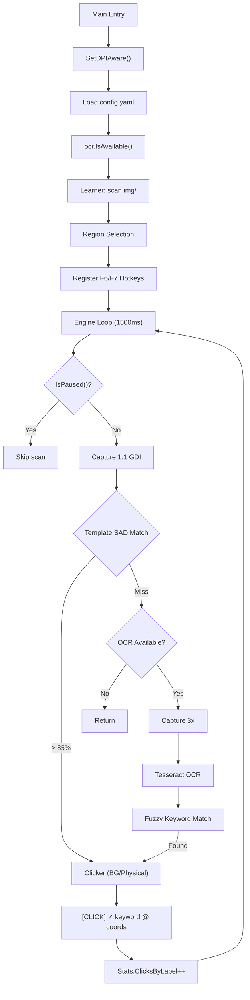

# Kiến Trúc Hệ Thống — AutoClickAccepted v3.2.0

## Tổng Quan

`AutoClickAccepted` được xây dựng hoàn toàn bằng Go (Zero-CGO) theo kiến trúc **Hybrid Dual-Path**:
- **Fast Path:** Template Matching bằng pixel SAD — so khớp ảnh mẫu 1:1 với màn hình
- **Slow Path:** Tesseract OCR Fallback — đọc chữ trên UI khi template không khớp

Sử dụng `golang.org/x/sys/windows` để gọi trực tiếp Windows API (GDI, User32).

---

## Các Module Cốt Lõi (9 Modules)

### 1. `internal/capture` — Chụp Màn Hình
Sử dụng `user32.dll` và `gdi32.dll` (GDI) để chụp ảnh màn hình:
- `GetDC(0)` → `CreateCompatibleDC` → `BitBlt` → `GetDIBits`
- Tốc độ ~10ms/frame
- Hỗ trợ upscale bằng nearest-neighbor (factor 1x cho template, 3x cho OCR)
- Xử lý toạ độ đa màn hình (negative coordinates)

### 2. `internal/matcher` — Template Matching Engine
Thuật toán **Sum of Absolute Differences (SAD)** — pure Go, multi-threaded:
- **Coarse Pass:** 200 pixel sample → loại >99% candidates trong O(1)
- **Fine Pass:** Full pixel sweep (chỉ chạy nếu coarse pass pass)
- **4 goroutines** chia vùng quét theo Y
- **Alpha Mask:** Bỏ qua pixel transparent (alpha < 128)
- **Non-Maximum Suppression:** 150px radius → 1 best match per button
- **Early Exit:** Abort khi diff vượt threshold giữa chừng
- Ngưỡng: 85% pixel similarity = match → click

### 3. `internal/ocr` — Nhận Dạng Chữ (Tesseract)
Kết nối gián tiếp (`os/exec`) sang `tesseract.exe`:
- `--psm 11` (Sparse Text) — tối ưu cho UI buttons
- `-c debug_file=NUL` — chặn C++ memory leak warnings
- `CREATE_NO_WINDOW` — không flash CMD window
- **`IsAvailable()`** — check Tesseract 1 lần khi khởi động. Nếu không có → skip OCR hoàn toàn
- **Fuzzy matching:** Exact → Contains (≥5 chars) → Levenshtein distance (≤2)
- **Multi-word:** Sequential word match + concatenation ("Allow Once" = "AllowOnce")

### 4. `internal/engine` — Bộ Não
Loop Timer quản lý nhịp quét và click:
- **Pause/Resume:** `paused bool` + `sync.RWMutex`, toggle bằng F6
- **Hybrid Pipeline:** Template Match → (miss) → OCR Fallback → Click
- **Dedup:** Bán kính 300px — không click trùng cùng nút
- **Max 3 clicks/scan** — chống spam
- **Per-keyword stats** — `ClicksByLabel map[string]int`
- **OCR gate:** Skip OCR path nếu Tesseract chưa cài

### 5. `internal/hotkey` — Global Hotkey (**MỚI v3.2.0**)
Đăng ký phím tắt toàn hệ thống qua Win32 `RegisterHotKey`:
- **F6** = Toggle Pause/Resume
- **F7** = Stop (graceful shutdown)
- Chạy `GetMessageW` message pump trong goroutine riêng
- Hoạt động kể cả khi console không focus

### 6. `internal/clicker` — Click Chuột
2 chế độ click:

| Chế độ | API | Khi nào dùng |
|--------|-----|-------------|
| **Background** (mặc định) | `WindowFromPhysicalPoint` → `ScreenToClient` → `PostMessageW` | Không cướp chuột vật lý |
| **Physical** (fallback) | `SetCursorPos` → `SendInput` | Khi Background fail |

Fallback tự động: Background fail → Physical.

### 7. `internal/learner` — Tự Học
Khi khởi động, quét `img/` folder:
1. Ảnh ≤ 200x200 → template pixel matching
2. Ảnh lớn hơn → chỉ OCR, không dùng template (cảnh báo)
3. Upscale 3x → Tesseract → extract keywords
4. Filter noise, stop words, **anti-keywords** (Cancel, Close, Deny, Reject)
5. Merge vào config keywords (case-insensitive dedup)

### 8. `internal/logger` — Logging
5 log levels: `Debug`, `Info`, `Click`, `Error`, `Fatal`

| Level | Tag | Khi nào |
|-------|-----|--------|
| Debug | `[DEBUG]` | Chi tiết scan, OCR words (chỉ khi `log_level: debug`) |
| Info | `[INFO]` | Startup, config, learner, status |
| **Click** | `[CLICK] ✓` | **Mỗi lần click** — keyword, toạ độ, phương thức |
| Error | `[ERROR]` | Lỗi capture, OCR, click |
| Fatal | `[FATAL]` | Lỗi nghiêm trọng → exit |

Output: `io.MultiWriter(file, stdout)` — console + `autoclick.log` đồng thời.

### 9. `internal/selector` — Chọn Vùng Quét
PowerShell script tạo transparent overlay fullscreen:
- Opacity 0.3, cursor crosshair
- User kéo chuột → trả về `x,y,width,height`
- Skip nếu config có `scan_region`

---

## Pipeline Tương Tác

---

## Portability (Tính Di Động)

| Feature | Cách hoạt động |
|---------|---------------|
| Config path | `config.yaml` resolve relative to exe location, không phải CWD |
| Image path | `img/` resolve relative to exe location |
| Log path | `autoclick.log` nằm cạnh exe |
| Tesseract | Optional — bot vẫn chạy bằng template matching nếu không cài |
| DPI | `SetProcessDPIAware()` gọi khi khởi động |
| Single file | Copy `autoclick.exe` + `config.yaml` + `img/` = đủ |
